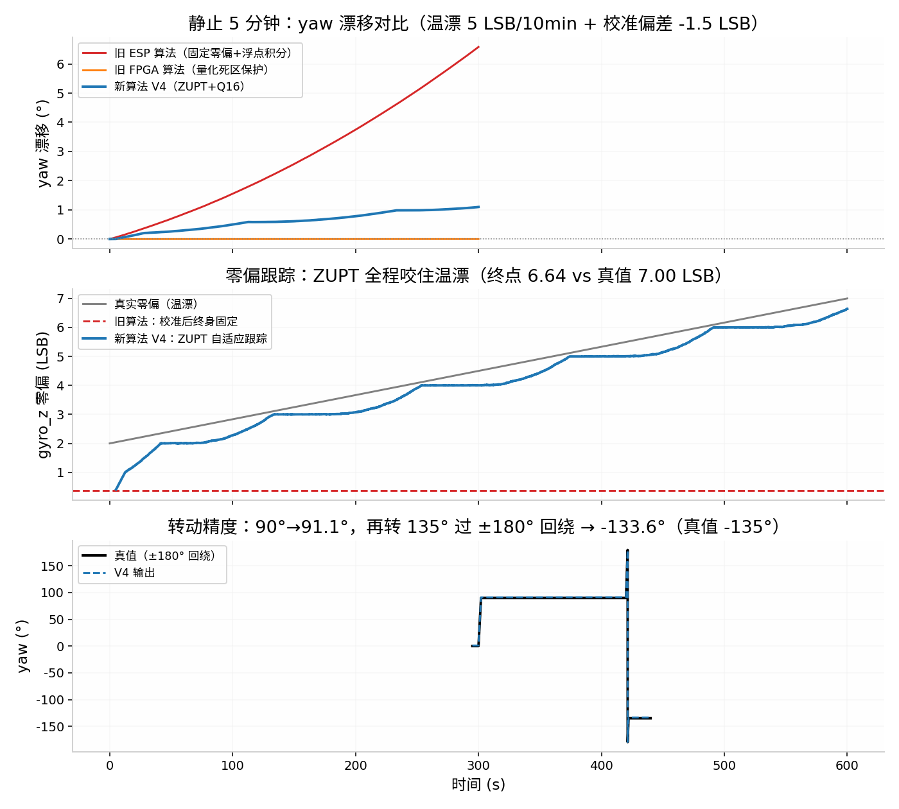

# 姿态三轴修复说明（attitude V4 / sensor_calc V2 / ESP V5）

> 适用仓库：`jiA-AS/smart_car_pld2026`（在已合入"遥控三档双屏联动"包的基线上修改）
> 解决问题：①姿态角一直飘；②只有 pitch/roll 两个角，补齐 yaw

---

## 一、先回答你的两个问题

### 1. 陀螺仪型号与安装方向（已查鱼香官方资料确认）

| 项目 | 官方事实 | 结论 |
|---|---|---|
| IMU 型号 | FishBot 主控板载 **MPU6050**（官方驱动库 `fishros/MPU6050_light`） | 与你代码里 `GYRO_LSB_PER_DPS=131`（±250dps）、`ACC 16384`（±2g）一致，**不用改** |
| 安装方式 | 主控板**水平平放**，Z 轴朝上、X 轴朝车头、Y 轴朝左（ROS REP-103 车体坐标系） | 官方库公式 `accAngleX=atan2(accY,accZ)`、`accAngleY=atan2(-accX,…)` 与你 ESP/FPGA 代码**完全一致** |
| 轴向取反 | 官方库无取反 | `INV_P / INV_R / INV_Y` 保持 `0` 即可，装车后按文末"轴向实测验证表"过一遍 |

**结论：硬件安装和轴向定义都没有问题，不用动。**

### 2. 为什么之前只有 pitch / roll 两个角？

这是**物理原理决定的**，不是漏写：

- 互补滤波的绝对基准是**重力向量**（加速度计测的）。重力是竖直方向的，所以它能修正"绕水平轴的转动"（pitch/roll），但对"**绕竖直轴的转动**"（yaw/航向）**完全无感**——小车原地打转而重力向量纹丝不动。
- 要拿到不漂的 yaw，需要**磁力计**测地磁做基准（9 轴方案）。MPU6050 是 6 轴，**没有磁力计**。
- 鱼香官方 `MPU6050_light` 库同样如此：其文档明确写 *"heading (angle Z) is valid for small X and Y angles"*，Z 角就是纯陀螺积分。

所以 yaw 的唯一做法是 **gyro_z 开环积分 + 零偏自适应压制漂移**（本次新增），分钟级缓漂是 6 轴 IMU 的物理极限，属于正常现象。

---

## 二、漂移的根因诊断（按贡献排序）

| # | 根因 | 影响位置 | 严重度 |
|---|---|---|---|
| 1 | **ESP 端浮点积分无任何保护**：`pitch += (gyro-bias)/lsb*dt`，bias 校准后终身固定。任何残余零偏（校准误差、温漂）都被无限积分 | ESP 屏姿态角 | ★★★ 主凶 |
| 2 | **bias 终身固定**：MPU6050 零偏随温度漂移（典型 0.02~0.05 °/s/min，电机发热加剧），上电校准值几分钟后就过期 | ESP 屏 + FPGA 屏 | ★★★ |
| 3 | **校准期间姿态不锁零**：旧 attitude_cf 校准 2.56s 内用 bias=0 白积分，上电即带随机初始角 | FPGA 屏 P/R | ★★ |
| 4 | 航向 `theta_idx` 只有**整数度**，且 `ang_rate` 显示在 0/±1°s 间跳变 | 调试页观感、位置推算精度 | ★ |

> 注：FPGA 旧航向的整数 cdeg/tick 量化其实形成了 ≈66 LSB（0.5°/s）的"死区"，静止时小零偏恰好被量化掉——所以 FPGA 屏上 P/R 漂移比 ESP 屏轻。真正"一直在飘"的主要是 ESP 屏（根因 1+2）。

### 仿真验证（MPU6050 实测噪声 σ=0.8 LSB，温漂 5 LSB/10min，校准偏差 -1.5 LSB）

| 指标 | 旧 ESP 算法 | 旧 FPGA 算法 | 新算法 V4 |
|---|---|---|---|
| 静止 5 分钟 yaw 漂移 | **+6.5°（直线上升）** | 0°（死区保护） | **+1.1°** |
| 10 分钟含两次转动后误差 | +18.8° | +0.5°（但不回绕） | **+2.0°，±180° 回绕正确** |
| 零偏跟踪 | 不跟踪 | 不跟踪 | 全程咬住（终点 6.64/7.00 LSB） |
| 转 90° 精度 | — | — | 91.1° |

---

## 三、修复内容（8 个文件）

### FPGA 侧（5 个，`FPGA/替换/` 目录，按仓库原路径覆盖）

| 文件 | 修改 |
|---|---|
| `my_car/rtl/sensor_link/attitude_cf.v` | **V4 全重写**。①三轴 ZUPT 零偏自适应：静止判据（三轴 \|gyro-bias\|<4 LSB）成立时 `bias_q += zstep(diff)`，τ≈20s 跟踪温漂，带符号舍入补偿消除定点死区；②校准延长到 **512 tick（5.12s）**且**校准期姿态锁 0**（`cal_done` 后才积分）；③bias 用 **Q10 定点**（分辨率 1/512 LSB）；④新增 **yaw 轴**：gyro_z 积分，**Q16 cdeg 累加器**（40bit），±180° 自动回绕，新端口 `gyro_z` 输入、`yaw_cdeg` 输出、`INV_Y` 参数 |
| `my_car/rtl/sensor_link/sensor_calc.v` | **V2**。①bias_z 同样改 Q10+ZUPT 自适应（静止判据还 AND 四轮编码器增量全 0，更可靠）；②校准 256→512 tick；③航向小数累加器 `frac_cdeg`(16bit)→`frac_q`(**Q16 32bit**)，增量不再每拍量化成整数 cdeg，消除跳变 |
| `my_car/rtl/lcd_rgb_top/osd/osd_overlay.v` | 姿态行尾部加 `Y:+123.4` 显示（新端口 `yaw_cdeg`，跨时钟域 2 级同步） |
| `my_car/rtl/lcd_rgb_top/lcd_rgb_top.v` | 新增 `yaw_cdeg` 端口并接入 osd_overlay |
| `my_car/rtl/top_dual_ov5640_lcd.v` | 顶层连线：attitude_cf 接 `gyro_z(sl_gyro_z)` / `yaw_cdeg(att_yaw)`，lcd_rgb_top 接 `yaw_cdeg(att_yaw)` |

### ESP32 侧（3 个，`ESP32/` 目录）

| 文件 | 修改 |
|---|---|
| `esp/src/fishbot.cpp` | **V5**。姿态块重写：①bias 三轴化（加 bias_z）；②校准 200→**500 样本**；③三轴 ZUPT（静止时 `bias += gxd×dt/20`，与 FPGA 同 τ≈20s）；④新增 **yaw 浮点积分**（±180° 回绕）；⑤`updateAttitude(pitch, roll, yaw)` 三参 |
| `esp/lib/Displays/fishbot_display.h` | 加 `yaw_` 成员与三参 `updateAttitude` 声明 |
| `esp/lib/Displays/fishbot_display.cpp` | 姿态页（s1 中档）加 `Y:+123.4d` 行；为腾版面删去本页编码器两行（E0–E3 在调试页已有） |

---

## 四、替换步骤

1. FPGA 5 个文件按上表路径覆盖，**重新综合+实现**（attitude_cf 接口变了，必须全量重跑）。
2. ESP 3 个文件覆盖，PlatformIO 重新编译烧录。
3. 两侧没有协议变动（上行仍 V1.2/35B），**可以只升一侧先验证**，但建议一起升。

> ⚠️ **新的使用要求：上电后小车必须静置 5.12 秒**（原来 2.56s），期间不要碰车、不要发车。校准期间姿态输出锁 0，校准完成后才开始积分。

---

## 五、上车验证清单

1. **静止漂移**：放桌上静置 10 分钟，FPGA 屏 P/R/Y 与 ESP 屏姿态页，漂移应 < 2°（旧版 ESP 屏同期约 6~10°）。
2. **转动精度**： yaw 归零后手动转 90°，读数应在 90°±3°；再转回 0°，残余 < 3°。
3. **回绕**：持续同向转，yaw 过 +180° 应跳到 -180° 附近，不卡死、不溢出。
4. **校准纪律**：上电 5.12s 内晃动车 → 之后角度带固定偏差属预期，重新上电即可。
5. **轴向实测验证表**（若某项方向反了，只改对应参数，不要动公式）：

| 动作 | 期望 | 反了怎么办 |
|---|---|---|
| 车头下俯 | pitch 变负 | `INV_P=1` |
| 左轮抬高 | roll 变正 | `INV_R=1` |
| 俯视逆时针转（车头向左） | yaw 变正 | `INV_Y=1` |

---

## 六、参数备查

| 参数 | 位置 | 值 | 含义 |
|---|---|---|---|
| `CAL_TICKS` | attitude_cf / sensor_calc | 512 | 上电校准时长 5.12s |
| `STILL_TH` | attitude_cf | 4 LSB | 静止判据阈值（≈0.03°/s） |
| ZUPT 步长 | 两处 | 1/2048 per tick | bias 跟踪时间常数 ≈20s |
| `YAW_LIM` | attitude_cf | 18000×2¹⁶ | yaw ±180° 回绕点（Q16 cdeg） |
| ESP ZUPT k | fishbot.cpp | dt/20 | 与 FPGA 等效 τ≈20s |
